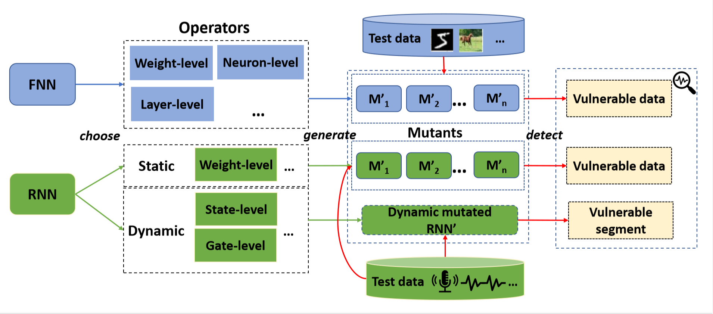

# DeepMutation++

DeepMutaion++ is a mutation testing framework for deep learning systems implemented in Python3.6 with TensorFlow1.13 and Keras2.2.4 . 
DeepMutaion++ supports both FNN and RNN mutants generation and can be used to analyze analyze the robustness of a DNN model against the input as a whole. Moreover, it allows to identify the vulnerable segment of a sequential input.

##### CNN mutation tool -> folder: cnn_mutation
##### RNN mutation tool -> folder: rnn_mutation

# Overview



# project structure
```
├── cnn_mutation                  # cnn mutation folder
│   ├── src                       # code folder
│   │   ├── cnn_operator.py       # define cnn mutation operators
│   │   ├── data_sort.py          # sort data by KS1
│   │   ├── generator.py          # mutants generator
│   │   ├── run.sh                # shell for test
│   │   ├── utils.py              # some useful functions
│   │   ├── __init__.py           # 
│   ├── __init__.py               #
│   ├── README.md                 # 
├── data                          # save some test data
├── img                           # save imgs
├── models                        # save some test models
├── result                        # save some test results
├── rnn_mutation                  # rnn mutation folder
│   ├── src                       # code folder
│   │   ├── keras                 # keras library
│   │   │   ├── ...               #
│   │   ├── __init__.py           #
│   │   ├── gru_operator.py       # define gru mutation operators
│   │   ├── lstm_operator.py      # define lstm mutation operators
│   │   ├── run.sh                # shell for test
│   │   ├── runner.py             # mutants generator
│   │   ├── sort_segment.py       # sort segment by KS2
│   │   ├── state_save.py         # save state
│   │   ├── utils.py              # some useful functions
│   ├── README.md                 #
│   ├── __init__.py               #
├── LICENSE                       # MIT license
├── README.md                     #
├── test.py                       # for my test
├── utils.py                      # some useful functions
```
